Bellabeat-Case-Study
================
Wuttipat S.
2023-02-06

## Introduction

Bellabeat, a high-tech manufacturer of health-focused products for
women. Bellabeat is a successful small company, but they have the
potential to become a larger player in the global smart device market.
Urška Sršen, cofounder and Chief Creative Officer of Bellabeat, believes
that analyzing smart device fitness data could help unlock new growth
opportunities for the company. You have been asked to focus on one of
Bellabeat’s products and analyze smart device data to gain insight into
how consumers are using their smart devices. The insights you discover
will then help guide marketing strategy for the company. You will
present your analysis to the Bellabeat executive team along with your
high-level recommendations for Bellabeat’s marketing strategy.

#### Product

- Bellabeat app: The Bellabeat app provides users with health data
  related to their activity, sleep, stress, menstrual cycle, and
  mindfulness habits. This data can help users better understand their
  current habits and make healthy decisions. The Bellabeat app connects
  to their line of smart wellness products.
- Leaf: Bellabeat’s classic wellness tracker can be worn as a bracelet,
  necklace, or clip. The Leaf tracker connects to the Bellabeat app to
  track activity, sleep, and stress.
- Time: This wellness watch combines the timeless look of a classic
  timepiece with smart technology to track user activity, sleep, and
  stress. The Time watch connects to the Bellabeat app to provide you
  with insights into your daily wellness.
- Spring: This is a water bottle that tracks daily water intake using
  smart technology to ensure that you are appropriately hydrated
  throughout the day. The Spring bottle connects to the Bellabeat app to
  track your hydration levels.
- Bellabeat membership: Bellabeat also offers a subscription-based
  membership program for users. Membership gives users 24/7 access to
  fully personalized guidance on nutrition, activity, sleep, health and
  beauty, and mindfulness based on their lifestyle and goals.

### Ask

###### A clear statement of the business task

1.  What are some trends in smart device usage?
2.  How could these trends apply to Bellabeat customers?
3.  How could these trends help influence Bellabeat marketing strategy?

## Business task

Finding a trend in digital health and wellness of wearable devices for
offering Bellabeat more advanced features that led to increasing
popularity of their customers for growing trend of smart health devices
user.

### Prepare

###### A description of all data sources used

FitBit Fitness Tracker Data (CC0: Public Domain, dataset made available
through Mobius): This Kaggle data set contains personal fitness tracker
from thirty fitbit users. Thirty eligible Fitbit users consented to the
submission of personal tracker data, including minute-level output for
physical activity, heart rate, and sleep monitoring. It includes
information about daily activity, steps, and heart rate that can be used
to explore users’ habits. \* Where is your data stored? \* How is the
data organized? Is it in long or wide format? \* Are there issues with
bias or credibility in this data? Does your data ROCCC? \* How are you
addressing licensing, privacy, security, and accessibility? \* How did
you verify the data’s integrity? \* How does it help you answer your
question? \* Are there any problems with the data?

### Process

###### Documentation of any cleaning or manipulation of data

Installing and loading common packages and libraries

``` r
# install.packages('tidyverse')
library(tidyverse)
```

    ## ── Attaching packages ─────────────────────────────────────── tidyverse 1.3.2 ──
    ## ✔ ggplot2 3.4.0      ✔ purrr   1.0.1 
    ## ✔ tibble  3.1.8      ✔ dplyr   1.0.10
    ## ✔ tidyr   1.3.0      ✔ stringr 1.5.0 
    ## ✔ readr   2.1.3      ✔ forcats 1.0.0 
    ## ── Conflicts ────────────────────────────────────────── tidyverse_conflicts() ──
    ## ✖ dplyr::filter() masks stats::filter()
    ## ✖ dplyr::lag()    masks stats::lag()

``` r
library(lubridate)
```

    ## 
    ## Attaching package: 'lubridate'
    ## 
    ## The following objects are masked from 'package:base':
    ## 
    ##     date, intersect, setdiff, union

Loading .csv files \##### Since there are 18 csv files those can
categories into 3 type 1. Daily 2. Hourly 3. Minutes In this case I only
pick *daily* and *hourly* for my analysis

``` r
activity <- read.csv("dailyActivity_merged.csv")
sleep <- read.csv("sleepDay_merged.csv")
calories <- read.csv("dailyCalories_merged.csv")
intensities <- read.csv("dailyIntensities_merged.csv")
steps <- read.csv("dailySteps_merged.csv")
```

Make columns name into lowercase of convinent.

``` r
names(activity) <- tolower(names(activity))
names(sleep) <- tolower(names(sleep))
names(calories) <- tolower(names(calories))
names(intensities) <- tolower(names(intensities))
names(steps) <- tolower(names(steps))
```

Change the name of a specific column to “date”

``` r
activity <- activity %>% 
  rename(date = activitydate)

sleep <- sleep %>% 
  rename(date = sleepday)

calories <- calories %>% 
  rename(date = activityday)

intensities <- intensities %>% 
  rename(date = activityday)

steps <- steps %>% 
  rename(date = activityday)
```

Formatting *date string* into *date type* data

``` r
activity$date <- as.Date(activity$date, format = "%m/%d/%Y")
calories$date <- as.Date(calories$date, format = "%m/%d/%Y")
intensities$date <- as.Date(intensities$date, format = "%m/%d/%Y")
steps$date <- as.Date(steps$date, format = "%m/%d/%Y")

sleep$date <- sleep$date %>% 
  as.POSIXct(format = "%m/%d/%Y %I:%M:%S %p") %>% 
  as.Date(format = "%m/%d/%Y")
```

Take a quick tour through imported tables.

``` r
print("activity")
```

    ## [1] "activity"

``` r
str(activity)
```

    ## 'data.frame':    940 obs. of  15 variables:
    ##  $ id                      : num  1.5e+09 1.5e+09 1.5e+09 1.5e+09 1.5e+09 ...
    ##  $ date                    : Date, format: "2016-04-12" "2016-04-13" ...
    ##  $ totalsteps              : int  13162 10735 10460 9762 12669 9705 13019 15506 10544 9819 ...
    ##  $ totaldistance           : num  8.5 6.97 6.74 6.28 8.16 ...
    ##  $ trackerdistance         : num  8.5 6.97 6.74 6.28 8.16 ...
    ##  $ loggedactivitiesdistance: num  0 0 0 0 0 0 0 0 0 0 ...
    ##  $ veryactivedistance      : num  1.88 1.57 2.44 2.14 2.71 ...
    ##  $ moderatelyactivedistance: num  0.55 0.69 0.4 1.26 0.41 ...
    ##  $ lightactivedistance     : num  6.06 4.71 3.91 2.83 5.04 ...
    ##  $ sedentaryactivedistance : num  0 0 0 0 0 0 0 0 0 0 ...
    ##  $ veryactiveminutes       : int  25 21 30 29 36 38 42 50 28 19 ...
    ##  $ fairlyactiveminutes     : int  13 19 11 34 10 20 16 31 12 8 ...
    ##  $ lightlyactiveminutes    : int  328 217 181 209 221 164 233 264 205 211 ...
    ##  $ sedentaryminutes        : int  728 776 1218 726 773 539 1149 775 818 838 ...
    ##  $ calories                : int  1985 1797 1776 1745 1863 1728 1921 2035 1786 1775 ...

``` r
print("sleep")
```

    ## [1] "sleep"

``` r
str(sleep)
```

    ## 'data.frame':    413 obs. of  5 variables:
    ##  $ id                : num  1.5e+09 1.5e+09 1.5e+09 1.5e+09 1.5e+09 ...
    ##  $ date              : Date, format: "2016-04-11" "2016-04-12" ...
    ##  $ totalsleeprecords : int  1 2 1 2 1 1 1 1 1 1 ...
    ##  $ totalminutesasleep: int  327 384 412 340 700 304 360 325 361 430 ...
    ##  $ totaltimeinbed    : int  346 407 442 367 712 320 377 364 384 449 ...

``` r
print("calories")
```

    ## [1] "calories"

``` r
str(calories)
```

    ## 'data.frame':    940 obs. of  3 variables:
    ##  $ id      : num  1.5e+09 1.5e+09 1.5e+09 1.5e+09 1.5e+09 ...
    ##  $ date    : Date, format: "2016-04-12" "2016-04-13" ...
    ##  $ calories: int  1985 1797 1776 1745 1863 1728 1921 2035 1786 1775 ...

``` r
print("intensities")
```

    ## [1] "intensities"

``` r
str(intensities)
```

    ## 'data.frame':    940 obs. of  10 variables:
    ##  $ id                      : num  1.5e+09 1.5e+09 1.5e+09 1.5e+09 1.5e+09 ...
    ##  $ date                    : Date, format: "2016-04-12" "2016-04-13" ...
    ##  $ sedentaryminutes        : int  728 776 1218 726 773 539 1149 775 818 838 ...
    ##  $ lightlyactiveminutes    : int  328 217 181 209 221 164 233 264 205 211 ...
    ##  $ fairlyactiveminutes     : int  13 19 11 34 10 20 16 31 12 8 ...
    ##  $ veryactiveminutes       : int  25 21 30 29 36 38 42 50 28 19 ...
    ##  $ sedentaryactivedistance : num  0 0 0 0 0 0 0 0 0 0 ...
    ##  $ lightactivedistance     : num  6.06 4.71 3.91 2.83 5.04 ...
    ##  $ moderatelyactivedistance: num  0.55 0.69 0.4 1.26 0.41 ...
    ##  $ veryactivedistance      : num  1.88 1.57 2.44 2.14 2.71 ...

``` r
print("steps")
```

    ## [1] "steps"

``` r
str(steps)
```

    ## 'data.frame':    940 obs. of  3 variables:
    ##  $ id       : num  1.5e+09 1.5e+09 1.5e+09 1.5e+09 1.5e+09 ...
    ##  $ date     : Date, format: "2016-04-12" "2016-04-13" ...
    ##  $ steptotal: int  13162 10735 10460 9762 12669 9705 13019 15506 10544 9819 ...

Verify all tables contain all of volunteer - All tables contain 33
consented user except *sleep* which mean some of them take the device
off while sleep.

``` r
n_distinct(activity$id)
```

    ## [1] 33

``` r
n_distinct(calories$id)
```

    ## [1] 33

``` r
n_distinct(intensities$id)
```

    ## [1] 33

``` r
n_distinct(sleep$id)
```

    ## [1] 24

``` r
n_distinct(steps$id)
```

    ## [1] 33

#### Merging data

- Merge all dataframe into one by using *id* and *date* as keys
- By merging data, now we can visualize all important features that
  store in different tables.
- Since *sleep* having 24 unique user, I use left-join to keep all
  identical user for analysis.
- I only merge *activity* and *sleep* to activity already contains other
  table’s columns with avoid columns duplication after merging all
  available tables.

``` r
merge_df <- activity
#merge_df <- left_join(merge-df, calories, by = c("id","date"))
#merge_df <- left_join(merge_df, intensities, by = c("id", "date"))
merge_df <- left_join(merge_df, sleep, by = c("id", "date"))
#merge_df <- left_join(merge_df, steps, by = c("id", "date"))

# See structure inside merged dataframe
str(merge_df)
```

    ## 'data.frame':    943 obs. of  18 variables:
    ##  $ id                      : num  1.5e+09 1.5e+09 1.5e+09 1.5e+09 1.5e+09 ...
    ##  $ date                    : Date, format: "2016-04-12" "2016-04-13" ...
    ##  $ totalsteps              : int  13162 10735 10460 9762 12669 9705 13019 15506 10544 9819 ...
    ##  $ totaldistance           : num  8.5 6.97 6.74 6.28 8.16 ...
    ##  $ trackerdistance         : num  8.5 6.97 6.74 6.28 8.16 ...
    ##  $ loggedactivitiesdistance: num  0 0 0 0 0 0 0 0 0 0 ...
    ##  $ veryactivedistance      : num  1.88 1.57 2.44 2.14 2.71 ...
    ##  $ moderatelyactivedistance: num  0.55 0.69 0.4 1.26 0.41 ...
    ##  $ lightactivedistance     : num  6.06 4.71 3.91 2.83 5.04 ...
    ##  $ sedentaryactivedistance : num  0 0 0 0 0 0 0 0 0 0 ...
    ##  $ veryactiveminutes       : int  25 21 30 29 36 38 42 50 28 19 ...
    ##  $ fairlyactiveminutes     : int  13 19 11 34 10 20 16 31 12 8 ...
    ##  $ lightlyactiveminutes    : int  328 217 181 209 221 164 233 264 205 211 ...
    ##  $ sedentaryminutes        : int  728 776 1218 726 773 539 1149 775 818 838 ...
    ##  $ calories                : int  1985 1797 1776 1745 1863 1728 1921 2035 1786 1775 ...
    ##  $ totalsleeprecords       : int  2 NA 1 2 1 NA 1 1 1 NA ...
    ##  $ totalminutesasleep      : int  384 NA 412 340 700 NA 304 360 325 NA ...
    ##  $ totaltimeinbed          : int  407 NA 442 367 712 NA 320 377 364 NA ...

``` r
summary(merge_df)
```

    ##        id                 date              totalsteps    totaldistance   
    ##  Min.   :1.504e+09   Min.   :2016-04-12   Min.   :    0   Min.   : 0.000  
    ##  1st Qu.:2.320e+09   1st Qu.:2016-04-19   1st Qu.: 3790   1st Qu.: 2.620  
    ##  Median :4.445e+09   Median :2016-04-26   Median : 7399   Median : 5.250  
    ##  Mean   :4.858e+09   Mean   :2016-04-26   Mean   : 7638   Mean   : 5.491  
    ##  3rd Qu.:6.962e+09   3rd Qu.:2016-05-04   3rd Qu.:10729   3rd Qu.: 7.715  
    ##  Max.   :8.878e+09   Max.   :2016-05-12   Max.   :36019   Max.   :28.030  
    ##                                                                           
    ##  trackerdistance  loggedactivitiesdistance veryactivedistance
    ##  Min.   : 0.000   Min.   :0.0000           Min.   : 0.000    
    ##  1st Qu.: 2.620   1st Qu.:0.0000           1st Qu.: 0.000    
    ##  Median : 5.250   Median :0.0000           Median : 0.210    
    ##  Mean   : 5.477   Mean   :0.1078           Mean   : 1.501    
    ##  3rd Qu.: 7.710   3rd Qu.:0.0000           3rd Qu.: 2.065    
    ##  Max.   :28.030   Max.   :4.9421           Max.   :21.920    
    ##                                                              
    ##  moderatelyactivedistance lightactivedistance sedentaryactivedistance
    ##  Min.   :0.0000           Min.   : 0.000      Min.   :0.000000       
    ##  1st Qu.:0.0000           1st Qu.: 1.950      1st Qu.:0.000000       
    ##  Median :0.2400           Median : 3.370      Median :0.000000       
    ##  Mean   :0.5674           Mean   : 3.345      Mean   :0.001601       
    ##  3rd Qu.:0.8000           3rd Qu.: 4.790      3rd Qu.:0.000000       
    ##  Max.   :6.4800           Max.   :10.710      Max.   :0.110000       
    ##                                                                      
    ##  veryactiveminutes fairlyactiveminutes lightlyactiveminutes sedentaryminutes
    ##  Min.   :  0.00    Min.   :  0.00      Min.   :  0.0        Min.   :   0.0  
    ##  1st Qu.:  0.00    1st Qu.:  0.00      1st Qu.:127.0        1st Qu.: 729.0  
    ##  Median :  4.00    Median :  6.00      Median :199.0        Median :1057.0  
    ##  Mean   : 21.14    Mean   : 13.56      Mean   :192.8        Mean   : 990.2  
    ##  3rd Qu.: 32.00    3rd Qu.: 19.00      3rd Qu.:263.5        3rd Qu.:1229.0  
    ##  Max.   :210.00    Max.   :143.00      Max.   :518.0        Max.   :1440.0  
    ##                                                                             
    ##     calories    totalsleeprecords totalminutesasleep totaltimeinbed 
    ##  Min.   :   0   Min.   :1.000     Min.   : 58.0      Min.   : 61.0  
    ##  1st Qu.:1830   1st Qu.:1.000     1st Qu.:361.0      1st Qu.:402.8  
    ##  Median :2140   Median :1.000     Median :433.0      Median :463.0  
    ##  Mean   :2306   Mean   :1.115     Mean   :418.7      Mean   :458.0  
    ##  3rd Qu.:2795   3rd Qu.:1.000     3rd Qu.:490.0      3rd Qu.:526.2  
    ##  Max.   :4900   Max.   :3.000     Max.   :796.0      Max.   :961.0  
    ##                 NA's   :543       NA's   :543        NA's   :543

Since I assume consented users mostly have work schedule as 9 am to 5
pm, so their activity likely a weekly routine. - Let transform date into
new column *weekday*

``` r
merge_df$weekday = wday(merge_df$date, label = TRUE, abbr = FALSE, week_start = 1)
```

## Analyze and Share

###### A summary of your analysis

###### Supporting visualizations and key findings

### Visualize

``` r
# Calories correlation
ggplot(merge_df, aes(x=totalsteps, y=calories)) + geom_point(aes(color = calories)) + geom_smooth()
```

    ## `geom_smooth()` using method = 'loess' and formula = 'y ~ x'

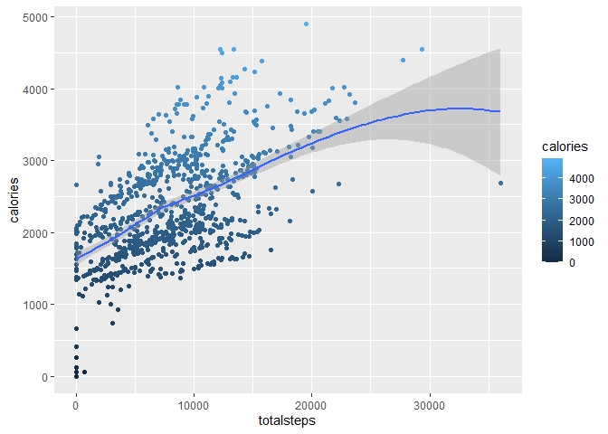<!-- -->

``` r
ggplot(merge_df, aes(x=totaldistance, y=calories)) + geom_point(aes(color = calories)) + geom_smooth()
```

    ## `geom_smooth()` using method = 'loess' and formula = 'y ~ x'

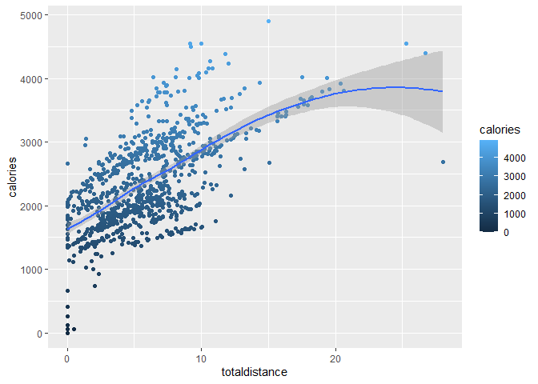<!-- -->

``` r
ggplot(merge_df, aes(x=veryactivedistance, y=calories)) + geom_point(aes(color = calories)) + geom_smooth()
```

    ## `geom_smooth()` using method = 'loess' and formula = 'y ~ x'

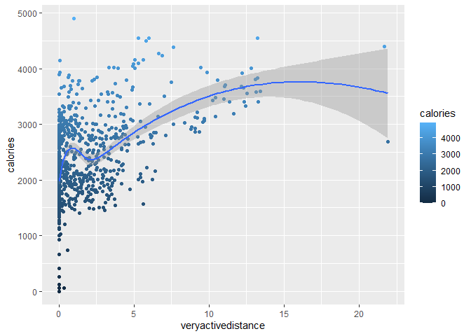<!-- -->

``` r
ggplot(merge_df, aes(x=sedentaryactivedistance, y=calories)) + geom_point(aes(color = calories))
```

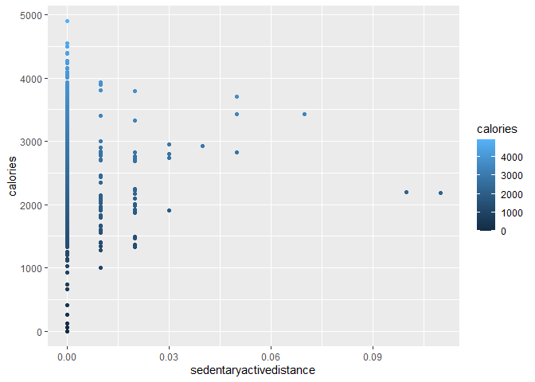<!-- -->

``` r
ggplot(merge_df, aes(x=totalminutesasleep, y=calories)) + geom_point(aes(color = calories)) + geom_smooth()
```

    ## `geom_smooth()` using method = 'loess' and formula = 'y ~ x'

    ## Warning: Removed 543 rows containing non-finite values (`stat_smooth()`).

    ## Warning: Removed 543 rows containing missing values (`geom_point()`).

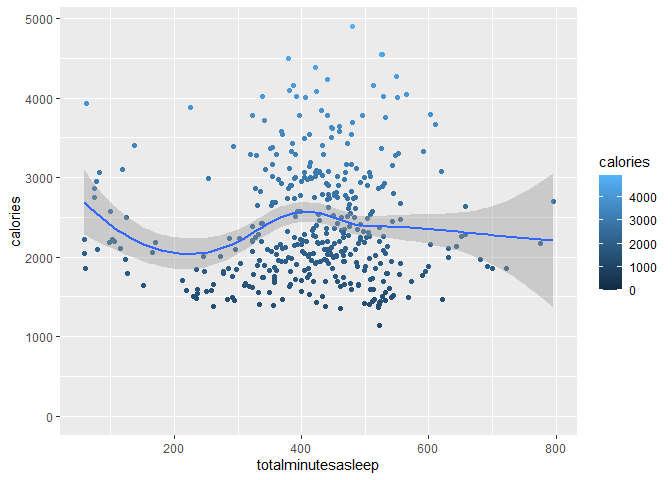<!-- -->

``` r
ggplot(merge_df, aes(x=totaltimeinbed, y=calories)) + geom_point(aes(color = calories)) + geom_smooth()
```

    ## `geom_smooth()` using method = 'loess' and formula = 'y ~ x'

    ## Warning: Removed 543 rows containing non-finite values (`stat_smooth()`).
    ## Removed 543 rows containing missing values (`geom_point()`).

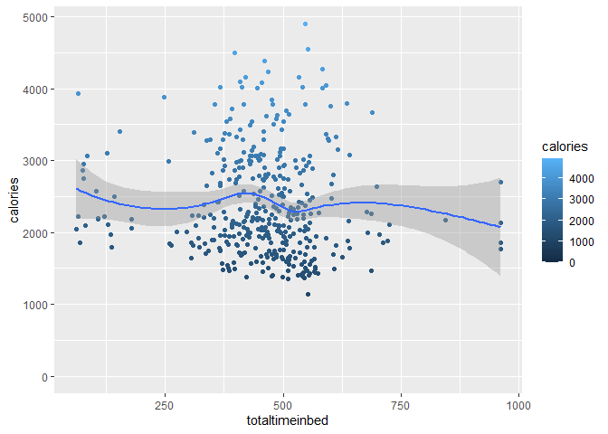<!-- -->
\* There high correlation betwwen *calories* and *(steps, totaldistance,
veryactivedistance)*

##### Weekday’s activity

- By seeing weekly behvioring, I expect to see relational different
  between weekend and weekday

``` r
# Grouping dataframe by weekday
weekday_df = merge_df %>% 
  group_by(weekday) %>% 
  drop_na() %>% 
  summarise(
    totalsteps = mean(totalsteps),
    totaldistance = mean(totaldistance),
    trackerdistance = mean(trackerdistance),
    veryactiveminutes = mean(veryactiveminutes),
    fairlyactiveminutes = mean(fairlyactiveminutes),
    lightlyactiveminutes = mean(lightlyactiveminutes),
    sedentaryminutes = mean(sedentaryminutes),
    calories = mean(calories),
    totalminutesasleep = mean(totalminutesasleep),
    totaltimeinbed = mean(totaltimeinbed)
  )
```

``` r
# Plot Weekday's activity
ggplot(weekday_df) + geom_bar(stat = "identity", aes(x=weekday, y=totalsteps, fill=weekday)) + labs(title="Average Steps", y="Average Steps")
```

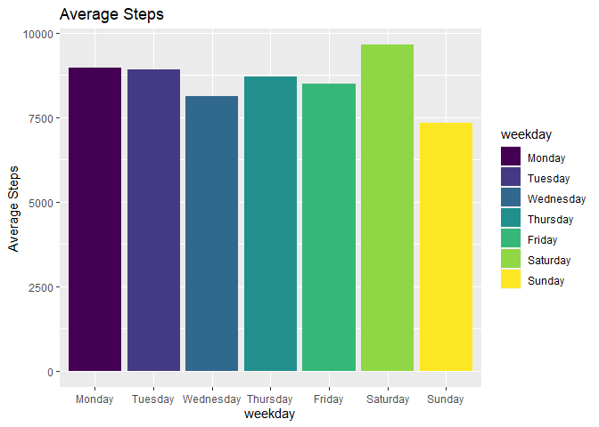<!-- -->

``` r
ggplot(weekday_df) + geom_bar(stat = "identity", aes(x=weekday, y=totaldistance, fill=weekday)) + labs(title = "Average Distance", y="Average Distance")
```

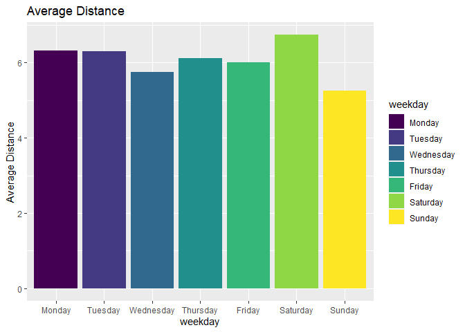<!-- -->

``` r
ggplot(weekday_df) + geom_bar(stat = "identity", aes(x=weekday, y=veryactiveminutes, fill=weekday)) + labs(title = "Average Very Active Minutes")
```

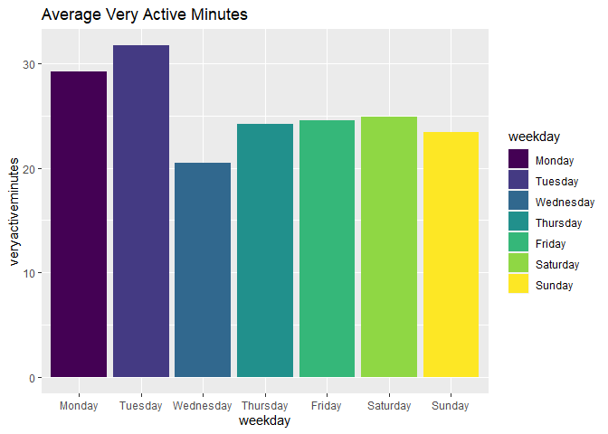<!-- -->

``` r
ggplot(weekday_df) + geom_bar(stat = "identity", aes(x=weekday, y=fairlyactiveminutes, fill=weekday)) + labs(title = "Average Fairy Active Minutes")
```

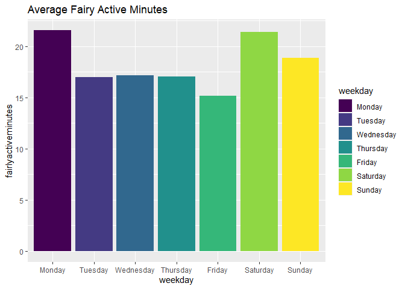<!-- -->

``` r
ggplot(weekday_df) + geom_bar(stat = "identity", aes(x=weekday, y=lightlyactiveminutes, fill=weekday)) + labs(title = "Average Lightly Active Minutes")
```

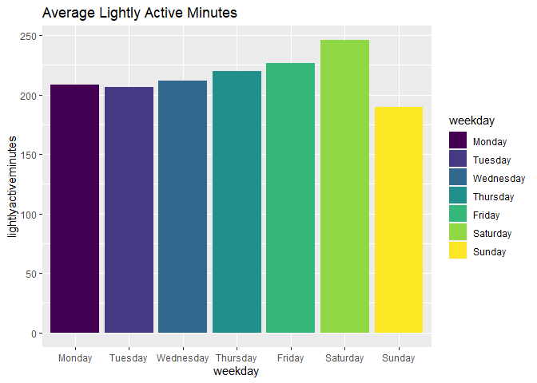<!-- -->

``` r
ggplot(weekday_df) + geom_bar(stat = "identity", aes(x=weekday, y=sedentaryminutes, fill=weekday)) + labs(title = "Average Sedentary Minutes")
```

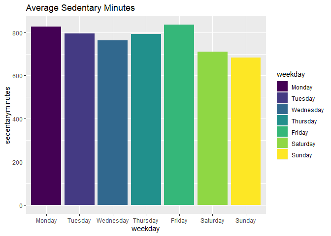<!-- -->

``` r
ggplot(weekday_df) + geom_bar(stat = "identity", aes(x=weekday, y=calories, fill=weekday)) + labs(title = "Average Calories")
```

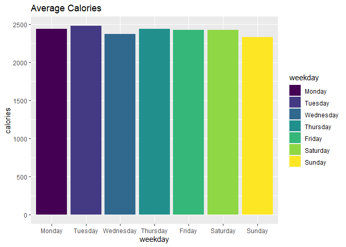<!-- -->

``` r
ggplot(weekday_df) + geom_bar(stat = "identity", aes(x=weekday, y=totalminutesasleep, fill=weekday)) + labs(title = "Average Minutes Sleep")
```

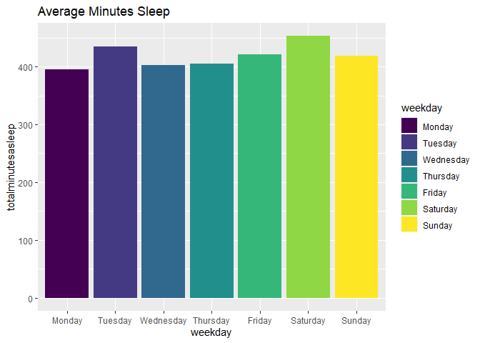<!-- -->

``` r
ggplot(weekday_df) + geom_bar(stat = "identity", aes(x=weekday, y=totaltimeinbed, fill=weekday)) + labs(title = "Average Minutes Bedtinme")
```

<!-- --> -
An average sedentary minutes happen during workday more the holiday
which mean sample are having long sitting for work.

#### Let explore for other possible relation throgh metrix plot.

``` r
merge_df %>%
  select(totalsteps,totaldistance,calories, totalminutesasleep) %>% 
  pairs(main = "Scatterplot Matrix with Regression Lines",
        panel = function(x, y, ...) {
        points(x, y, ...)
        abline(lm(y ~ x), col = "gray", lwd = 2)
      })
```

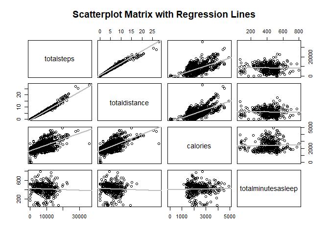<!-- -->

``` r
merge_df %>%
  select(totalminutesasleep,totalsteps, calories, totaltimeinbed) %>% 
  pairs(main = "Scatterplot Matrix with Regression Lines",
        panel = function(x, y, ...) {
        points(x, y, ...)
        abline(lm(y ~ x), col = "gray", lwd = 2)
      })
```

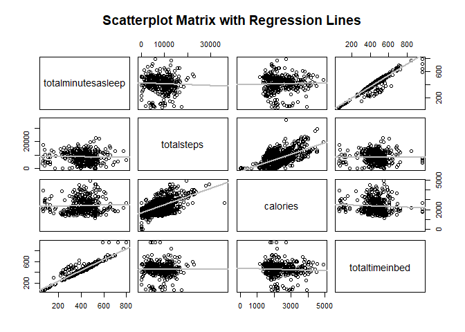<!-- --> -
High correlation between *totalminutesasleep* and *totaltimeinbed*

``` r
merge_df %>%
  select(totalminutesasleep,veryactiveminutes, fairlyactiveminutes, lightlyactiveminutes, sedentaryminutes) %>% 
  pairs(main = "Scatterplot Matrix with Regression Lines",
        panel = function(x, y, ...) {
        points(x, y, ...)
        abline(lm(y ~ x), col = "gray", lwd = 2)
      })
```

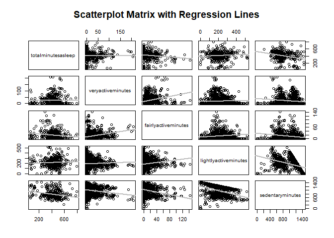<!-- -->

``` r
ggplot(data = merge_df, aes(x=sedentaryminutes, y=totalminutesasleep)) + geom_point() + geom_smooth()
```

    ## `geom_smooth()` using method = 'loess' and formula = 'y ~ x'

    ## Warning: Removed 543 rows containing non-finite values (`stat_smooth()`).

    ## Warning: Removed 543 rows containing missing values (`geom_point()`).

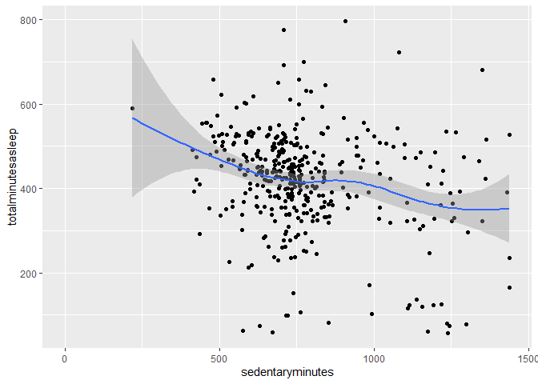<!-- --> -
Slightly negative correlation between *sedentaryminutes* and
*totalminutesasleep*

## Summarize of the analysis results

1.  More user active more calories they burned.
2.  Our user mostly work at office where they have to sitting all the
    time which mean spending their energy less, cause them harder to
    sleep at night.
3.  Time spend in bed will led to longer you sleep.

## Suggestion of the Bellabeat app

1.  Bellabeat should provides personalized guidance based on user’s
    lifestyle and goals.
2.  Notify wearer when they sitting for too long. Encourage them for
    take a walk or make a light exercise.
3.  Remind the device owner about time to go bed for their suitable
    sleeping hour and keeping their healthy behavior.
